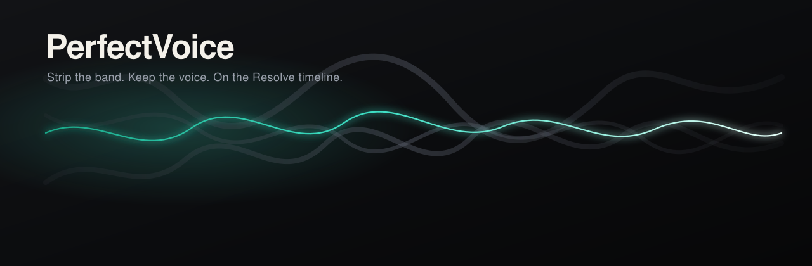
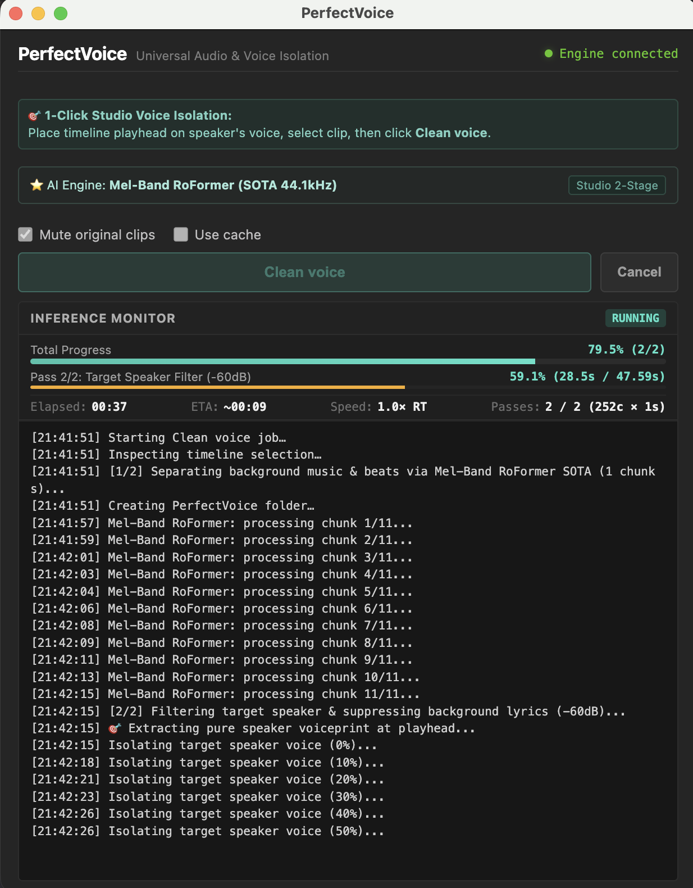
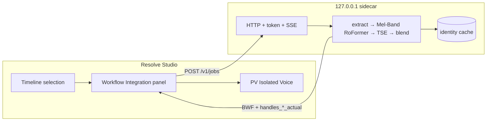

# PerfectVoice

[](https://github.com/nnthinh/PerfectVoiceOFX/actions/workflows/ci.yml)
[](LICENSE)
[](https://www.blackmagicdesign.com/products/davinciresolve)
[](#requirements)

<p align="center">
  
</p>

**Isolate dialogue from musical accompaniment inside [DaVinci Resolve](https://www.blackmagicdesign.com/products/davinciresolve) Studio.** Select clips on the Edit or Fairlight page, run *Remove musical accompaniment*, and get a new `PV Isolated Voice` track — sample-accurate, non-destructive, no trip through another app.

The repo is named `PerfectVoiceOFX` because that is what the project was called on day one. **The host is not OpenFX.** Resolve’s OFX surface is an image-effect API. There is no official audio buffer. PerfectVoice lives at **Workspace → Workflow Integrations → PerfectVoice**: an Electron panel plus a localhost Python sidecar.

<p align="center">
  
</p>

<p align="center"></p>

## What it is

```
clip on timeline  →  inspect + reject  →  sidecar job
                                          extract (ffmpeg)
                                          resample (soxr)
                                          Pass 1: Mel-Band RoFormer (SOTA 44.1kHz)
                                          Pass 2: Target Speaker Extraction (TSE 192-d)
                                          wet/dry + BWF
                 ←  place on "PV Isolated Voice"
```

- **Pass 1 (Vocal Separation):** SOTA **[Mel-Band RoFormer](https://github.com/lucidrains/mel-band-roformer)** (`Kimberley Jensen` Studio 44.1kHz model) / Meta Demucs `htdemucs_ft`. Music source separation — vocals vs. accompaniment/beats/instruments.
- **Pass 2 (Target Speaker Isolation):** Zero-shot **ECAPA-TDNN TSE** extracts a 192-dimensional voiceprint from your playhead position, applying cosine similarity filtering and Hanning smoothing to eliminate background lyrics and other talkers (-60dB suppression).
- **Cache** is a full identity hash (48 kHz vs 96 kHz is two keys). Re-run the same clip and you skip infer.
- **Weights are fetched on-demand.** First use: auto-downloads official Kimberley Jensen SOTA checkpoint (~871 MB) with real-time download progress. Infer only loads local weights. Jobs never phone home.

## What it is not

| Not this | Why |
| --- | --- |
| A simple denoiser | PerfectVoice is built for separating vocals from *music, beats, and overlapping lyrics*. |
| A replacement for Resolve Voice Isolation | Use Voice Isolation when the problem is pure *static room noise*. Use PerfectVoice when the problem is *a song/backing music under the dialogue*. |
| An OpenFX / VST realtime plugin | Offline sidecar. SOTA Transformer inference processes high-resolution audio chunks, not a 10–43 ms Fairlight buffer. |
| A weight redistributor | Checkpoints are downloaded on-demand from official HuggingFace repositories. |

Full design (Vietnamese): [docs/design.md](docs/design.md).

## Requirements

| | v1.0 |
| --- | --- |
| OS | **macOS 13+ Apple Silicon** |
| Host | **DaVinci Resolve Studio standalone 20.0+** (recommended **21.0.4**). Download from Blackmagic, **not** the Mac App Store. |
| Free Resolve | No Workflow Integration Electron → **not supported** |
| UI | English. Docs in Vietnamese. |
| Windows + NVIDIA CUDA | v1.1 path in [`installer/windows/`](installer/windows/) |
| Intel Mac / Linux | Non-goal |

## Quick start (macOS)

The public tree is a **working dogfood**. The `.pkg` currently stages a spawn-contract **hello-engine** stub. Production infer is the Python sidecar until a PyInstaller onedir lands.

```bash
git clone https://github.com/nnthinh/PerfectVoiceOFX.git
cd PerfectVoiceOFX

# 1. Panel — user-space only, will not touch /Library plugins
bash host/com.perfectvoice.panel/install-user.sh

# 2. Engine stub (spawn + /health). Optional until the onedir exists:
bash installer/macos/install-user.sh

# 3. Start Resolve Studio → Workspace → Workflow Integrations → PerfectVoice
# (Model weights auto-download on first launch with real-time UI progress)
```

Dump a live selection (Studio must be open, clip selected):

```bash
python3 scripts/spikes/dump_resolve_selection.py --out /tmp/pv-selection-dump.json
```

Dogfood without Resolve:

```bash
python3 scripts/isolate_cli.py /path/to/clip.wav /tmp/pv-out mel_band_roformer
```

## Architecture



The sidecar binds **localhost only**. Auth is a token file or stdin — never `--token-fd 3`. Missing weights fail closed.

## Tests

```bash
python3 -m pip install -r requirements-dev.txt
bash scripts/ci_forbid_demucs_urls.sh
python3 -m unittest tests.unit.test_schemas tests.unit.test_serve tests.unit.test_weight_fetch \
  tests.unit.test_resample_sync tests.unit.test_blend tests.unit.test_tse
python3 -m unittest tests.golden.test_sync tests.golden.test_cache_keys tests.golden.test_appendix_a
node --test host/com.perfectvoice.panel/resolve/*.test.js host/com.perfectvoice.panel/engine.test.js
```

`shared/schema/` is the clip / params / job v1 contract. Clients must not send `wet_dry_sample_rate`. `handles_*_actual` is job-result only.

## Status

Public preview. First open-source release.

| Done | Next |
| --- | --- |
| Panel + sidecar + reject matrix | Live Resolve dump to pin speed / reverse / Elastic Wave keys |
| Mel-Band RoFormer SOTA 44.1kHz + Zero-shot TSE | PyInstaller onedir (no user Python) |
| macOS user-space installer | Developer ID + notarize |
| Windows installer sketches | CUDA engine SKU |

## Contributing

See [CONTRIBUTING.md](CONTRIBUTING.md) and the [code of conduct](CODE_OF_CONDUCT.md). Security: [SECURITY.md](SECURITY.md).

## License

- PerfectVoice source: [MIT](LICENSE), Copyright 2026 PerfectVoice contributors.
- Third-party and model weight terms: [NOTICE](NOTICE), [docs/licenses/](docs/licenses/).

---

### Tiếng Việt

Plugin **Workflow Integration** cho DaVinci Resolve **Studio**: chọn clip → *Clean voice* → track `PV Isolated Voice` đồng bộ sample. Engine là sidecar Python (Mel-Band RoFormer Studio AI + Target Speaker Extraction), **không** phải OpenFX.

- Mạnh với **bóc tách giọng hát / lời thoại khỏi nhạc nền, beat, và dập tắt lời hát bè (-60dB)** nhờ kiến trúc 2-Pass (RoFormer + TSE).
- Tự động tải checkpoint SOTA Kimberley Jensen (~871 MB) khi mở lần đầu với giao diện hiển thị tiến trình thời gian thực.
- Thiết kế đầy đủ: [docs/design.md](docs/design.md).
