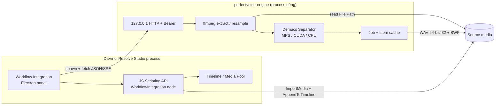

# PerfectVoice — Plugin tách giọng khỏi nhạc nền cho DaVinci Resolve Studio

| Trường | Giá trị |
| --- | --- |
| **Document** | Design / Technical Plan |
| **Product** | PerfectVoice (repo: `PerfectVoiceOFX`) |
| **Author** | TBD |
| **Date** | 2026-08-18 |
| **Status** | Draft (rev 4 — 2026-08-18, user chốt OQ 1 + 6) |
| **Host** | DaVinci Resolve **Studio standalone** (tải từ Blackmagic, **không** Mac App Store). **Min 20.0**; **test / recommended 21.0.4** (2026-08-05). 18.6 không hỗ trợ. |
| **Primary OS (v1.0)** | **macOS 13+ Apple Silicon (arm64) only.** Windows 10/11 + NVIDIA CUDA = v1.1. Intel Mac / Linux = non-goal. |
| **UI language** | **English UI** (panel, buttons, errors). **Vietnamese docs** (design + user-guide). Chốt user 2026-08-18. |
| **Weights (user 2026-08-18)** | Dev: được fetch official `htdemucs*` vào local dir (checksum). Ship: **không bundle**. User **click** lần đầu → tải về local repo → load chỉ `Separator(..., repo=Path)`. Cấm auto-fetch khi `Separator()` không có click. |
| **Workspace đã xác minh** | `/Users/nnthinh/DEV/PerfectVoiceOFX` — **greenfield tuyệt đối** (thư mục trống, không README, không SDK, không source) |

Tên repo giữ `PerfectVoiceOFX` vì đây là cách user đặt. User nói “OFX/addon” theo nghĩa sản phẩm mở rộng Resolve; **host vẫn là Workflow Integration + sidecar, không phải OpenFX** (§3.1, KD 1).

**Effort / critical path (1 trang):** selection spike (tuần 1) → notarize + spawn-from-WI (tuần 2) → engine I/O + Demucs `repo=` local → panel + **user-click download (PR 15)**. Không còn legal-hold chặn fetch. ~3–5 tháng dogfood macOS. Chi tiết § Effort.

---

## Overview

Editor / colorist / sound editor trong DaVinci Resolve Studio cần tách **giọng thoại khỏi nhạc nền / accompaniment** ngay trên timeline: chọn clip, chạy xử lý **offline**, nhận track audio mới đồng bộ sample-accurate, không phá clip gốc. Engine được user chỉ định là **Meta Demucs** (`facebookresearch/demucs`, bảo trì tại `adefossez/demucs`; code MIT). Weights official: dev được tải; bản ship user click tải — không bundle, không auto-fetch (user chốt 2026-08-18; rủi ro #327 ghi ở § Security).

Demucs (HTDemucs v4) là **music source separation** (drums / bass / other / vocals) trên MUSDB HQ + ~800 bài — **không** phải speech enhancer, **không** phải SOTA vocal 2025–26 (BS-RoFormer / Mel-RoFormer thường hơn trên vocal; xem A9). Nó mạnh với **bed nhạc**. Nó **yếu** với HVAC, giao thông, phòng, mic. PerfectVoice vì vậy là **pipeline hai stage**, không phải một nút “crystal-clear”:

1. Ingest **source-file extract** theo contract §3.3 (reject retime / FX / thiếu File Path — đây **không** phải output mixer Fairlight).
2. Resample → 44.1 kHz stereo (native HTDemucs).
3. Infer `vocals` stem bằng Demucs (stage bắt buộc; copy UI: *Remove musical accompaniment*).
4. **Tùy chọn, default OFF:** DeepFilterNet 3 giảm residual noise môi trường (MIT + Apache-2.0 cả weights). Copy UI: *Reduce residual environmental noise*. Không bật thì **không** claim “giọng trong trẻo”.
5. Wet/dry với mix gốc (cùng sample-rate domain — xem graph), output gain, optional mono.
6. Resample về project rate (thường 48 kHz, đôi khi 96 kHz).
7. Ghi WAV + BWF, import non-destructive lên track `PV Isolated Voice`.

v1.0 = **macOS arm64 + Studio standalone 20+**. Kiến trúc: **Workflow Integration** (Studio-only Electron) + **Scripting API** + **sidecar** Python/PyTorch. “OFX/addon” trong lời user = sản phẩm mở rộng; **không** đổi sang OpenFX. VST3/AU không phải primary (buffer Fairlight 10–43 ms). UI English; docs tiếng Việt.

---

## Background & Motivation

### Hiện trạng

DaVinci Resolve Studio đã có **Voice Isolation** (Resolve FX / DaVinci Neural Engine, từ ~18.1, Edit / Fairlight). Đó là đối thủ **bổ sung**, không phải thứ ta “thắng” bằng cách khẳng định nó kém:

- Mạnh và nhẹ trên noise tương đối dừng; gần realtime; không cần buffer 2048.
- **Không** phải music source separation kiểu Demucs (không xuất `vocals` stem tái lập). Writeup sản xuất vẫn báo Voice Isolation *làm khá tốt* cả một số bed nhạc — **không** claim Resolve “thường để lại harmonic bleed” như sự thật phổ quát.
- Niche PerfectVoice: **offline MSS có kiểm soát** (wet/dry, handles, cache tái lập, stem Demucs tường minh, batch clip, không đụng Neural Engine in-process). Gợi ý UI: *thử Voice Isolation trước nếu tạp âm là noise, không phải bài hát*.

Đối chứng ngoài Resolve: iZotope RX Dialogue Isolate, Waves Clarity Vx, Adobe Enhance Speech, UVR (Demucs / BS-RoFormer). Chúng đều **offline / render-style**. Đó là mô hình UX đúng.

### Pain points cần giải

| Pain | Hệ quả |
| --- | --- |
| Phải rời Resolve → UVR / Demucs CLI → import lại | Mất timecode, sai in/out, lệch 1–2 frame, phá linked A/V |
| Cần MSS có cache / handles / wet-dry *trong* NLE | Voice Isolation không cho stem tái lập + cache hash; RX/Clarity rời app |
| Demucs CLI không biết handles, cache, batch clip | Click ở cut, render lại 40 phút interview mỗi lần đổi 1 param |
| Nhét PyTorch vào process Resolve | Crash NLE = mất project; codesign / ABI / GIL |

### Ràng buộc host (không được paper over)

- **Studio bắt buộc vì Workflow Integration Electron** (và vì đây là product target). Free Resolve **vẫn load third-party OFX**; nhiều Resolve FX *built-in* mới là Studio-only / watermark. Cột “third-party OFX = Studio” là **sai** — OFX bị loại vì image API, không vì license Studio.
- OpenFX trong Resolve là **image effect API** (OpenFX 1.4 / một phần 1.5 color management ở Resolve 21). Không có sound-effects API. Forum Blackmagic xác nhận không có đường audio buffer chính thức từ OFX.
- Fairlight nhận **VST3** (Win/Mac) và **AU** (Mac). Buffer playback điển hình: 512 / 1024 / 2048 sample @ 48 kHz = **10.7 / 21.3 / 42.7 ms**. HTDemucs infer theo segment **tối đa 7.8 s**. Neutone có VST “realtime Demucs” nhưng đó là mô hình chưng cất khác, không phải `htdemucs` / `htdemucs_ft`.
- Scripting API (Python / Lua / JS qua Workflow Integration) đọc được `MediaPoolItem.GetClipProperty("File Path")`, `GetClipProperty("Sample Rate")`, `TimelineItem.GetStart/GetEnd/GetSourceStartFrame/GetSourceEndFrame/GetSourceStartTime/GetSourceEndTime/GetLinkedItems`, import media, `AddTrack("audio", "stereo")`, `AppendToTimeline({mediaType: 2, trackIndex, recordFrame})`. **Resolve 21.0.4** thêm `Timeline.GetSelectedClips()` (kèm linked audio) — **primary selection path**. 20.x: fallback playhead / track (xem ma trận §3.6). **Không** có API “Extract Audio” tương đương UI. v1 ingest = ffmpeg từ file nguồn theo contract reject, **không** phải mixer Fairlight. Project / timeline sample rate: dump `project.GetSetting()` / `timeline.GetSetting()` trên máy Studio — **không đoán tên key** trước spike.
- Workflow Integration (từ Resolve 17, Win/macOS, **không Linux Electron**) là panel Electron, `WorkflowIntegration.node` + JS API mirror Python. Cài vào:
  - macOS: `/Library/Application Support/Blackmagic Design/DaVinci Resolve/Workflow Integration Plugins/`
  - Windows: `%PROGRAMDATA%\Blackmagic Design\DaVinci Resolve\Support\Workflow Integration Plugins\`

Repo hiện **trống**. Mọi đường dẫn dưới đây là *đề xuất sẽ tạo*, không phải file đã tồn tại.

---

## Goals & Non-Goals

### Goals (v1.0 — macOS arm64)

- Chọn 1..N clip hợp lệ trên Edit hoặc Fairlight → **Remove musical accompaniment** → track audio mới, sync với hình, nguồn không bị ghi đè.
- Stage 1 bắt buộc: Demucs `htdemucs` (default) / `htdemucs_ft` (Quality). Wet/dry chỉ cần `vocals` + mix gốc.
- Stage 2 **có trong v1**, optional, **default OFF**: DeepFilterNet 3 (license sạch) cho residual HVAC/traffic/mic. Không bật → không claim “giọng trong trẻo”.
- Ingest contract A (source-file extract) + **reject matrix** (retime, reverse, Elastic Wave, clip FX, slip, thiếu File Path, 5.1, nested).
- Clip 10–60 phút: chunk overlap-add, cap RAM/VRAM, cancel, resume theo cache.
- Cache hash đủ identity output (kể cả `project_sample_rate`, `sample_format`, `wet_dry_sample_rate`) — re-run miễn phí, không trúng nhầm file.
- Sidecar chết **không** kéo Resolve chết.
- Installer không bắt user tự cài conda. Host = **standalone Studio**, không MAS.
- Privacy: 100% local. Không cloud inference (tải weights official là HTTPS do user click, không upload media).
- UI **English**; tài liệu **tiếng Việt**.
- Sync ≤ 1 sample trên clip **speed 100%** (contract A). Không công bố RTF/ETA máy cho tới khi `docs/benchmarks.md` có số đo trên hardware mục tiêu.
- Weights: dev script `download_demucs.py` được phép. Ship: nút English *Download model* (user click) → local dir → `Separator(..., repo=)`. Không bundle trong installer.

### Non-Goals (v1)

- **Bundle** official `htdemucs*` trong installer. **Silent auto-fetch** khi `Separator()` / job chạy mà user chưa click *Download model*.
- Live insert VST3/AU / monitoring realtime.
- OFX video plugin, Fusion macro, Color page effect.
- Cloud / upload media.
- Tách drums/bass/other cho music production.
- VoiceFixer / Facebook Denoiser.
- 5.1 / Atmos / adaptive > 2 ch — **reject** (không downmix thầm).
- Speed ≠ 100%, reverse, Elastic Wave, clip FX enable, audio slip, Fairlight-only không File Path, nested / compound / Fusion generator / tone — **reject** (không im lặng sai sync).
- Bounce/render ingest (A8) — hoãn; không phải default v1.
- BS-RoFormer / Mel-RoFormer thay Demucs (A9) — user named Demucs.
- Linux; Intel Mac first-class (best-effort only: `torch>=2.1,<2.3`, Python ≤ 3.12).
- Windows v1.0 (v1.1). Mac App Store Resolve.
- Train / fine-tune Demucs.
- Thay thế Voice Isolation.
- GUI giả lập RX.

### Success metrics (đo được)

| Metric | Target v1 | Cách đo |
| --- | --- | --- |
| Sync error (clip speed 100%, no FX) | ≤ 1 sample @ project rate | Cross-corr isolated vs extract cùng in/out |
| Chunk-boundary click | Không audible; discontinuity < −80 dBFS sau OLA | Synthetic sine + unit test + listening |
| Music bleed (Demucs on) | Cải thiện rõ vs mix gốc trên bed nhạc; không claim SDR tuyệt đối | Listening 5 clip vàng + optional vocal SDR nếu có ref |
| Residual noise (DFN on) | Cải thiện noise dừng vs Demucs-only; không bắt buộc STOI | Listening; optional DNSMOS nếu không có clean ref |
| RTF / ETA trên UI | **Không ship số** cho tới `docs/benchmarks.md` | Fixture 60 s trên máy dogfood; trước đó UI = “calibrating…” hoặc bound CPU 1.5× |
| Resolve stability | Engine crash → panel lỗi; timeline không đổi | Kill sidecar giữa job |
| Re-run cache hit | < 200 ms + đúng bytes (kể cả đổi 48↔96 kHz phải **miss**) | Golden: cùng source, hai project rate → hai key |
| Silent Demucs auto-fetch | **0** request Hub/AWS khi user chưa click | PR 05a mock-net; URL chỉ trong `download_demucs.py` + `weight_fetch.py` (PR 15) |

---

## Proposed Design

### 3.1 Chọn bề mặt plugin — quyết định có bằng chứng

| Bề mặt | Phù hợp audio offline ML? | Realtime? | UI? | Studio? | Verdict |
| --- | --- | --- | --- | --- | --- |
| **OpenFX** (Blackmagic OpenFX SDK) | Không. Image API; không audio buffer chính thức | Video GPU | Inspector video | Free Resolve **vẫn** host third-party OFX; nhiều built-in FX mới Studio-only | **Loại** làm primary |
| **Fairlight VST3 / AU** | Đúng domain, sai deadline | Bắt buộc callback trong 10–43 ms | Editor window VST | Không bắt buộc Studio cho VST scan | **Loại** làm primary; optional v2 “offline bounce companion” |
| **Workflow Integration** | Đúng: panel + JS API = Scripting API | Không cần | HTML/CSS/JS bền | **Có** | **Primary** |
| **Scripting API** thuần (Workspace > Scripts) | Đúng I/O timeline | Không | UIManager nghèo / không panel | Một phần free | **Companion** — fallback CLI-in-Resolve |
| **Fusion macro / OFX trên clip** | Sai domain | — | — | — | **Loại** |
| **Hybrid panel + sidecar + script** | Đúng | Offline | Đúng | Studio | **Đây là kiến trúc** |

**Primary UX** (bắt chước RX Dialogue Isolate, không bắt chước Fairlight FX insert):

1. Mở **Workspace → Workflow Integrations → PerfectVoice**.
2. Ở Edit hoặc Fairlight, chọn clip / range / cả track (panel poll selection).
3. Chọn preset: *Fast* (`htdemucs`) / *Quality* (`htdemucs_ft`) / custom.
4. Wet/dry, output gain, mono, handles, destination track.
5. **Remove musical accompaniment** (+ optional DFN) → progress (segment callback) + Cancel.
6. Sidecar ghi WAV → panel gọi Scripting API import + đặt clip trên track mới tại `recordFrame = GetStart()`.
7. Default **non-destructive**: clip gốc giữ nguyên, có option mute audio gốc / unlink.

**Không** áp dụng như FX trên Color page. Colorist vẫn mở panel từ Color page được (Workflow Integration không gắn page), nhưng selection lấy từ current timeline — khuyến nghị thao tác từ Edit/Fairlight.



### 3.2 Vì sao không nhúng PyTorch vào OFX `.bundle`

- Resolve load OFX in-process. PyTorch kéo theo libomp, MKL/Metal, CUDA, proto, hàng trăm dylib. Hardened Runtime + notarization trên macOS gần như chắc chắn vỡ (JIT, unsigned helpers, relative rpath).
- GIL + thread pool PyTorch vs render thread Resolve = deadlock / priority inversion.
- Crash trong `OfxImageEffectSuite` = chết cả NLE, mất unsaved grade.
- OFX anyway không đưa audio vào plugin.

Sidecar là lựa chọn nhàm chán và đúng.

### 3.3 Pipeline xử lý audio (v1)

```mermaid
sequenceDiagram
  autonumber
  actor User
  participant Panel as Workflow panel
  participant API as Resolve JS API
  participant Eng as Engine sidecar
  participant Disk as Filesystem

  User->>Panel: Remove accompaniment
  Panel->>API: GetSelectedClips (21.0.4) + inspect + reject matrix
  API-->>Panel: ClipManifest[] (hợp lệ) / errors
  Panel->>Eng: POST /v1/jobs (manifest + params + token + allowed_roots)
  loop Mỗi clip
    Eng->>Disk: ffmpeg extract PCM + handles (sample-accurate)
    Eng->>Eng: resample → 44.1 kHz stereo
    Eng->>Eng: Demucs separate_tensor (segment 7.8, overlap 0.25)
    Eng-->>Panel: SSE progress (segment_offset / audio_length)
    opt enhancer = deepfilternet3
      Note over Eng: engine set wet_dry_sample_rate=48000
      Eng->>Eng: resample x và v → 48 kHz
      Eng->>Eng: DFN3 chỉ trên v
    else enhancer = none
      Note over Eng: engine set wet_dry_sample_rate=44100
    end
    Eng->>Eng: wet/dry tại wet_dry_sample_rate (engine-derived)
    Eng->>Eng: resample y → project rate, dither nếu 24-bit
    Eng->>Disk: write WAV + cache index
  end
  Eng-->>Panel: job done + paths + handles_left/right_actual
  Panel->>API: ImportMedia, AddTrack, AppendToTimeline(mediaType=2)
  API-->>User: Track "PV Isolated Voice"
```

#### Ingest contract A (v1) — source-file extract, không phải mixer Fairlight

v1 **không** đọc những gì Fairlight đang phát (gain, pan, **track** FX, **track** automation, clip FX, Voice Isolation đã gắn, speed, reverse, Elastic Wave, slip). Nó đọc **file media nguồn** + in/out nguồn. Đó là đánh đổi có chủ đích (nhanh, sample-accurate, không Deliver render). Bounce ingest = A8, không phải v1.

**Track FX / automation:** **không reject**, **bỏ qua** (không đọc). A/B dogfood = isolated WAV vs **file nguồn**, không vs mix Fairlight đã EQ/comp. Copy panel một dòng: *“So với file gốc, không phải mixer.”*

**Fairlight-only / recording / cache path:** `GetClipProperty("File Path")` có thể rỗng hoặc trỏ file cache Resolve. Coi đây là **bài toán resolve path**, chưa giải. Thử lần lượt: File Path → dump toàn bộ `GetClipProperty()` lấy key path khác nếu có → reject. Copy: *“Không tìm thấy media file. Relink, hoặc bounce audio ra WAV rồi import.”* Overview không được nói “Fairlight-only đã hỗ trợ”.

**Đọc rate:** `MediaPoolItem.GetClipProperty("Sample Rate")` cho file nguồn. Project/timeline rate: spike PR 00b **dump** `project.GetSetting()` / `timeline.GetSetting()` trên Studio 20 và 21.0.4; pin tên key thật vào `shared/schema` — **cấm đoán** `"timelineSampleRate"` trước khi có dump.

**Reject matrix (panel chặn trước khi POST job):**

| Điều kiện | Cách phát hiện (spike phải xác nhận property name) | Copy |
| --- | --- | --- |
| Nested / compound / Fusion / generator / tone | type / name / không File Path | “Un-nest / không hỗ trợ generator.” |
| Offline / File Path rỗng sau mọi fallback | File Path empty | “Clip offline hoặc Fairlight-only không có file — relink / bounce.” |
| Speed ≠ 100% | clip speed / retime property ≠ 1.0 | “Speed/retime ≠ 100%. Reset speed hoặc bounce (v1.1+).” |
| Reverse | reverse flag | “Clip đảo ngược — reject.” |
| Elastic Wave | EW enabled | “Tắt Elastic Wave hoặc bounce.” |
| Clip FX / Voice Isolation enable trên item | FX stack non-empty | “Tắt clip FX (kể cả Voice Isolation) hoặc bounce. v1 đọc file gốc, không đọc FX.” |
| Audio slip / source offset không khớp mapping đã tính | source time vs timeline duration lệch sau khi tính speed=1 | “Slip/offset lạ — reject để khỏi lệch miệng.” |
| >2 channels (5.1, 7.1, adaptive) | `source_channels > 2` hoặc mapping > 2 | **Reject.** Không Lo/Ro, không lấy C thầm. “Fold xuống stereo trong Fairlight rồi chạy lại.” |
| Proxy-only không resolve được original | File Path = proxy, original offline | “Relink original (không xử lý proxy).” |

Hợp lệ: speed 100%, không reverse/EW/clip-FX, File Path tồn tại, mono hoặc stereo, linked A/V hoặc embedded.

**Dedupe selection (một output / một media identity):** `GetSelectedClips()` trên 21.0.4 trả về video **và** audio linked. Rule:

1. Group theo `GetLinkedItems()` (một group = một A/V sync set).
2. Trong group: **ưu tiên File Path của audio sibling**. Bỏ video item nếu group đã có audio clip.
3. Không có audio sibling (embedded only): lấy video File Path + `-map 0:a:{audio_stream_index}`.
4. Hai audio siblings khác path (dual-system + mixdown): **một job / path**, không enqueue cả hai trừ khi user tick riêng trong panel.
5. Fallback 20.x (playhead + linked): cùng rule — không push video rồi lại push linked audio.

- Embedded map: `channel_map` từ `GetSourceAudioChannelMapping()` nếu parse được; default stream 0, channels `[0]` hoặc `[0,1]`.
- Proxy / optimized: luôn original File Path.

**Vùng extract:** ưu tiên `GetSourceStartTime()` / `GetSourceEndTime()` (giây, subframe) → nhân `source_sample_rate` → `source_in_sample` / `source_out_sample` (làm tròn half-up, document). Fallback: `GetSourceStartFrame()` / `GetSourceEndFrame()` + **rational fps** của *source media* (không `24.0` cho 23.976). Xem **Appendix A**.

**Handles:** mặc định **0.500 s** mỗi phía, **clamp vào file** (`H_left_actual = min(H, t0)`, `H_right_actual = min(H, max(0, file_duration − t1))`). Ghi **handles thực** vào WAV. Place **bắt buộc** dùng `handles_left_actual` / `handles_right_actual` engine trả về — không dùng `H` user request (clip bắt đầu < 0.5 s sẽ lệch miệng). Xem Appendix A.

#### Bước xử lý sau ingest

2. **Resample vào model**
   - Target: **44100 Hz**, 2 ch, float32, không normalize.
   - Resampler id pin: `soxr_hq_v1` (preferred). `julius` chỉ fallback test. `resampler_id` nằm trong cache hash.

3. **Demucs inference (4.1.0) — local `repo=` only**
   - API: `demucs.api.Separator(model=name, repo=local_repo, ...)` → `separate_tensor` + `callback` (cancel = raise).
   - Default: **`htdemucs`**. Quality: **`htdemucs_ft`**. Không default `mdx_extra`. Không `htdemucs_6s`.
   - **Normative load contract (luôn local `repo=`; fetch tách kênh):**
     1. `local_repo` = `~/Library/Application Support/PerfectVoice/models/demucs/` (Windows: `%LOCALAPPDATA%\PerfectVoice\models\demucs\`) — layout 4.1.0: bag YAML + safetensors.
     2. Infer **chỉ** `Separator(model=..., repo=Path(local_repo))`. **Cấm** `Separator(model="htdemucs")` / `get_model(name)` không `repo=` (4.1.0 sẽ Hub/AWS auto-download).
     3. `vocals_only_bag`: YAML trong `local_repo` → `Separator("04573f0d", repo=local_repo)`. Flag **off** tới A/B.
     4. `engine/models/manifest.json`: `name → filename → sha256` **chỉ** — không URL. URL official chỉ trong `scripts/download_demucs.py` (dev) và `weight_fetch.py` (PR 15, gọi sau user click).
     5. **Load path không mở socket Demucs.** Fetch = hàm riêng, allowlist host, chỉ sau click / CLI dev. DFN fetch tách kênh (PR 05d).
     6. Tests PR 05a: (i) fixture + `HF_HUB_OFFLINE=1` → separate OK; (ii) repo rỗng + HTTP mock **không** gọi download → job error *Model not installed* **và zero** request Hub/AWS. Tests PR 15: click / CLI → đúng file + sha256.
   - Segment **7.8 s** (trần Transformer). Overlap **0.25** (0.10 optional). Shifts **1** default.
   - Device: `mps` (Darwin arm64) → `cuda` → `cpu`. **4.0.1+:** trên MPS, **complex / STFT chạy CPU**, phần còn lại Metal. RTF Apple ≠ “full GPU”. Không đưa bảng §3.5 lên UI.
   - **`torch.load(..., weights_only=False)`** vẫn còn trong 4.1.0 (tương thích torch ≥ 2.6). Safetensors trên Hub **không** xóa pickle-RCE của nhánh fallback `.th`. Checksum + mode `0700` trên model dir bắt buộc.
   - Tắt auto-rescale. Soft-clip / report true-peak nếu > 0 dBFS.

4. **Stage 2 — DeepFilterNet 3 (v1, optional, default OFF)**
   - License: MIT + Apache-2.0 **code và weights** — enhancer sạch; **không** thay Demucs.
   - Graph (normative; sequence diagram phải khớp):
     - **Engine derive** `wet_dry_sample_rate` từ `enhancer`. Client **không** gửi field này (hoặc engine **ghi đè** trước khi hash).
     - `enhancer = none` → `wet_dry_sample_rate := 44100`; wet/dry trên `x`,`v` @ 44.1 kHz.
     - `enhancer = deepfilternet3` → resample `x` và `v` → 48000 → DFN3 **chỉ** `v` → wet/dry @ 48000 (`wet_dry_sample_rate := 48000`).
     - **Sau** wet/dry: resample `y` → `project_sample_rate`. Không blend ở project rate.
     - Fixture: DFN on, `project_sample_rate=96000` → tensor blend length = `round(duration * 48000)`; WAV xuất 96 kHz.
   - Không Denoiser 16 kHz. Không VoiceFixer.
   - UI: checkbox *Reduce residual environmental noise* — enable, default unchecked. Nút chính **không** đổi thành “crystal-clear”.

5. **Wet/dry + output**
   - `y = (1-w) * x + w * v` cùng rate = `wet_dry_sample_rate` **do engine gán**.
   - `w` default **0.85** (revisit sau dogfood — đã quyết định, không còn Open Question).
   - Gain 0 dB; optional mono mid sau blend.
   - WAV PCM 24-bit + TPDF default, hoặc float32. BWF `Originator=PerfectVoice`.
   - `output_sample_count` @ project rate; test resample ≤ 1 sample / 1 giờ.

6. **Import non-destructive**
   - Bin `PerfectVoice / <ProjectName> /`.
   - `AddTrack("audio", "stereo")` nếu chưa có `PV Isolated Voice`.
   - `AppendToTimeline` dùng **frame của WAV output**, không sample nguồn — Appendix A.
   - Không tự link isolated ↔ video. Option replace = mute audio gốc, không xóa media. Default **new track** (revisit sau dogfood).

### 3.4 Job, chunking, cancel, resume

- Clip > ~8 s đã bị Demucs tự `split`. Engine vẫn phải:
  - Stream extract (không load 60 phút float64 vào RAM một lúc nếu tránh được — `Separator.separate_tensor` hiện load cả tensor; **v1 chấp nhận load cả clip đã extract**, nhưng extract ra file WAV tạm 44.1 kHz, memmap nếu cần).
  - Cap: nếu `duration * rate * ch * 4 > 2 GiB` (~90 phút stereo f32 @ 44.1k), cắt thành cửa sổ 10 phút chồng 1 s, overlap-add ở ranh giới cửa sổ *ngoài* Demucs (Demucs đã OLA trong segment 7.8 s).
- Cancel: `callback` của `Separator` raise `JobCancelled`; bắt trong engine, xóa temp, giữ cache phần đã xong (cửa sổ 10 phút).
- Resume: cửa sổ đã có cache hash thì skip.
- Một job = N clip tuần tự (v1 không song song 2 clip trên 1 GPU — VRAM). Hàng đợi FIFO. Pause = cancel cửa sổ hiện tại sau segment.

### 3.5 Device, RTF, VRAM — số liệu **chưa xác minh**, không dùng cho ETA

Nguồn README (đáng tin): CPU ~1.5× realtime model default; GPU tối thiểu 3 GB; ~7 GB argument mặc định; HT segment max 7.8 s. Hàng device dưới đây là **ước lượng cộng đồng / suy từ track 3–4 phút — unverified, không được đưa vào panel / marketing / success-metric số**. MPS + STFT-on-CPU (4.0.1+) làm hàng Apple **đặc biệt không chắc**. `htdemucs_ft` vocals-only “~1× `htdemucs`” là **giả thuyết**, không lái ETA Quality.

**ETA UI:** chỉ sau khi PR benchmark ghi `docs/benchmarks.md` trên máy dogfood. Trước đó: “Calibrating…” hoặc bound bảo thủ **CPU 1.5×** (`duration * 1.5`). Không nhân `Σ duration * RTF_device` từ bảng này.

Ước lượng **unverified** cho 1 phút stereo 48 kHz (chỉ để lập kế hoạch nội bộ):

| Device | `htdemucs` RTF | Thời gian / 1 phút | `htdemucs_ft` RTF (full bag) | Thời gian / 1 phút |
| --- | --- | --- | --- | --- |
| Apple M1 Pro, MPS | ~0.25 | ~15 s | ~1.0 | ~60 s |
| Apple M4 Pro, MPS | ~0.06–0.08 | ~4–5 s | ~0.26 | ~16 s |
| NVIDIA RTX 3060 12 GB | ~0.2 | ~12 s | ~0.75 | ~45 s |
| NVIDIA RTX 4090 | ~0.06 | ~4 s | ~0.25 | ~15 s |
| CPU hiện đại (README) | ~1.5 | ~90 s | ~6 | ~6 phút |
| CPU máy yếu | 3–8 | vài phút | 12–30 | không dùng được interview dài |

`htdemucs_ft` vocals-only: **không** dùng cho ETA cho tới khi đo.

VRAM / unified memory:

- Floor README: 3 GB; default ~7 GB.
- 8 GB machine (MBA M2 8 GB, GPU laptop 8 GB): **bắt buộc** `segment` thấp hơn nếu OOM, `PYTORCH_NO_CUDA_MEMORY_CACHING=1` trên CUDA, không `shifts`, không 2 job. Panel hiện banner “Low memory mode”.
- MPS dùng unified memory — OOM ít hơn CUDA 8 GB nhưng sẽ đụng swap; phát hiện RSS và cảnh báo.

**Fairlight buffer vs RTF:** dù RTF = 0.06, latency một segment vẫn là 7.8 s compute + I/O. Không tồn tại đường “live insert HTDemucs”. VST3 chỉ hợp lý nếu sau này port model chưng cất (Neutone-class), ngoài scope v1.

### 3.6 Panel UX cụ thể

**Chỗ nút sống:** `Workspace > Workflow Integrations > PerfectVoice`. Không chèn Effects Library (tránh nhầm OFX). Script companion: `Workspace > Scripts > PerfectVoice > Remove Accompaniment`.

**Ngôn ngữ (user 2026-08-18):** mọi string panel / script / error = **English**. Design và `docs/user-guide.md` = **tiếng Việt**. Không i18n runtime ở v1.

**Trang Resolve:**

| Page | Hành vi |
| --- | --- |
| Edit / Cut | Primary. Selection video hoặc audio. |
| Fairlight | Primary cho audio-only / linked. |
| Color / Fusion / Deliver | Panel vẫn mở; đọc current timeline selection. Không đụng node graph / render queue. |
| Photo (Resolve 21) | Ngoài scope. |

**Ma trận Resolve (selection):**

| Version | Selection primary | Fallback |
| --- | --- | --- |
| **21.0.4+** (recommended) | `timeline.GetSelectedClips()` rồi **dedupe** §3.3 (ưu tiên audio sibling) | Playhead + `GetLinkedItems` + cùng dedupe |
| **20.0 – 21.0.3** (min supported) | Không giả định `GetSelectedClips` | Playhead + linked; hoặc “process enabled audio track under playhead”; user tick trong danh sách panel |
| **18.6 – 19.x** | **Không hỗ trợ** | — |
| MAS Resolve | **Không hỗ trợ** (sandbox, spawn sidecar kém) | Cài standalone Studio |

**Selection modes:** selected clips (21.0.4); range ∩ clips đã chọn; whole **selected** track (không iterate mọi audio item trên timeline). Batch: danh sách panel + checkbox. ETA: xem §3.5 (calibrating / CPU 1.5× cho tới benchmark).

**Controls:**

- Preset Fast / Quality / Custom.
- Wet 0–100% (default 85).
- Output gain −12…+12 dB.
- ☐ Fold to mono.
- Handles 0 / 0.25 / 0.5 / 1.0 s.
- Destination: new track (default) / replace (mute original).
- ☐ Use cache (default on).
- ☐ Reduce residual environmental noise (DeepFilterNet 3, default off).
- Advanced: model dropdown, overlap, shifts, device override, float32 out.

**Progress:** clip i/N, % segment, device, VRAM/RSS. ETA chỉ khi đã calibrate. Cancel luôn enable sau 1 s.

**Error states (copy phải cụ thể):**

| Điều kiện | Message |
| --- | --- |
| Không phải Studio / WI init fail | “PerfectVoice cần DaVinci Resolve Studio và Workflow Integrations.” |
| Sidecar không spawn / EPERM | “Không chạy được engine (spawn bị chặn hoặc chưa cài). Cần Studio standalone + engine đã codesign. Log: xem bảng path §3.8.” |
| Official weights missing | “Model not installed. [Download model] (~84 MB for Fast / ~330 MB for Quality).” Click → `POST /v1/models/download`. Không tự tải. |
| No GPU | “Chạy CPU. Thời gian có thể ≈ 1.5× độ dài clip (README Demucs). Tiếp tục?” |
| OOM | “Hết bộ nhớ GPU. Đã chuyển Low memory / CPU. Job sẽ chậm hơn.” |
| Disk < 2× input size | “Không đủ đĩa cho cache + output.” |
| Reject matrix | Dùng copy từng hàng bảng ingest. |
| Engine crash giữa chừng | “Engine dừng bất ngờ. Timeline không đổi. [Mở log] [Retry]” |

**A/B:** mute/solo `PV Isolated Voice` vs track gốc. Đó là so **file nguồn** (contract A), không phải mix Fairlight (track FX bị bỏ qua). Optional: “Solo isolated” → `SetTrackEnable`.

### 3.7 Cache, đường dẫn, portability

**Cache root (default):**

- macOS: `~/Library/Caches/PerfectVoice/`
- Windows: `%LOCALAPPDATA%\PerfectVoice\Cache\`

**Rendered stems (default, portable hơn cache OS):**

```
<ProjectMediaDir or next-to-source>/PerfectVoice/
  <project_uuid>/
    <clip_hash12>/
      voice.wav
      job.json
```

User chọn:

- *Next to source* (relative, dễ đem project).
- *Project cache dir* (một chỗ, dễ xóa).
- *Custom*.

`job.json` chứa hash inputs, model sha256, params, `source_path`, `source_in_sample`, output peak, engine version. Resolve media pool trỏ tuyệt đối; khi mở máy khác, relink giống media thường. Không embed stem vào `.drp`.

**Hash (mọi field đổi bytes trên đĩa đều phải có):**

```
sha256(
  file_id || src_in || src_out ||
  audio_stream_index || channel_map ||
  model_name || weights_sha256 || vocals_only_bag ||
  wet || gain || mono || handles_requested ||
  file_duration_seconds ||
  segment || overlap || shifts ||
  enhancer_id ||
  project_sample_rate || sample_format ||
  resampler_id || clip_policy ||   # clip_policy = "no_demucs_rescale"
  engine_semver
)
```

`wet_dry_sample_rate` **không** do client ghi — engine derive từ `enhancer_id` rồi mới hash (none→44100, dfn3→48000). `handles_*_actual` là hàm thuần `(t0, t1, H, file_duration)` — đã nằm trong `src_in`/`src_out` + `handles_requested` + `file_duration_seconds`; không hash thêm field độc lập (tránh panel/engine lệch). Place dùng actual **engine trả về**.

Golden: cùng source, 48 vs 96 kHz → hai key; pcm24 vs f32 → hai key; enhancer none vs dfn3 → hai key; clip `t0=0.2` + `H=0.5` → extract ngắn hơn 1.0 s handles “đủ”.

`file_id` = `(dev, ino, size, mtime)` POSIX; Windows `(volume serial, file index, size, mtime)`. Copy file = miss cache, chấp nhận. Không hash toàn bộ media 60 phút ở v1; Advanced “strict content hash”.

### 3.8 Sidecar process, IPC, spawn-from-WI, path table

**Binary:** `perfectvoice-engine` — PyInstaller **onedir** (debug dylib + notarize dễ hơn onefile). Không conda user.

**Host hỗ trợ:** Resolve Studio **standalone** tải từ Blackmagic. **Mac App Store Resolve bị loại** (sandbox, Hardened Runtime parent, `child_process.spawn` helper ngoài bundle gần như chắc EPERM).

**`enginePath` (đóng băng — installer + panel cùng rule):**

1. Env `PERFECTVOICE_ENGINE` nếu set và file tồn tại (dev).
2. macOS: `~/Library/Application Support/PerfectVoice/engine/perfectvoice-engine` (user payload, update không admin).
3. macOS fallback: `/Library/Application Support/PerfectVoice/engine/perfectvoice-engine`.
4. Windows (protocol sẵn từ PR 02, ship v1.1): `%LOCALAPPDATA%\PerfectVoice\engine\perfectvoice-engine.exe`.

Luôn `spawn` **absolute path**. Không `PATH`. Không relative.

**Spawn contract (panel nằm trong Electron *đã ký của Resolve*):**

1. `spawn(absEnginePath, ["serve", "--bind", "127.0.0.1", "--port", "0", "--token-file", tokenPath], { env: filtered, cwd: engineDir })`.
2. Engine **Developer ID signed + notarized**, cùng team id nếu được. Entitlement `com.apple.security.cs.disable-library-validation` trên **engine** (PyTorch dylib) — **không** yêu cầu re-sign Resolve.
3. Parent Resolve có Hardened Runtime / library validation: child khác signature có thể bị **EPERM**. Fail closed: copy “Sidecar không spawn”. Spike notarize (PR 00c) phải chứng minh spawn từ WI **trước** khi viết xong Separators.
4. Token: **không** `--token-fd 3` (không portable Win32). Panel ghi file one-shot `0600` vào `~/Library/Application Support/PerfectVoice/run/<uuid>.token` (Windows: `%LOCALAPPDATA%\PerfectVoice\run\`) chứa 256-bit hex; engine đọc, unlink ngay, bind, in `READY http://127.0.0.1:<port>` stdout. Alternative tương đương: token trên **stdin** một dòng rồi EOF — chọn một ở PR 02, giữ cả hai OS.
5. Bind **chỉ** `127.0.0.1`. Cấm `0.0.0.0`.
6. Idle 30 phút rồi thoát. Không launchd.
7. Lock: macOS `~/Library/Application Support/PerfectVoice/engine.lock`; Windows `%LOCALAPPDATA%\PerfectVoice\engine.lock`.

**Bảng path**

| | macOS | Windows (freeze protocol now) |
| --- | --- | --- |
| Engine | `~/Library/Application Support/PerfectVoice/engine/` | `%LOCALAPPDATA%\PerfectVoice\engine\` |
| Models | `~/Library/Application Support/PerfectVoice/models/` | `%LOCALAPPDATA%\PerfectVoice\models\` |
| Logs | `~/Library/Logs/PerfectVoice/` | `%LOCALAPPDATA%\PerfectVoice\Logs\` |
| Cache | `~/Library/Caches/PerfectVoice/` | `%LOCALAPPDATA%\PerfectVoice\Cache\` |
| Token/run | `~/Library/Application Support/PerfectVoice/run/` | `%LOCALAPPDATA%\PerfectVoice\run\` |
| Config | `~/Library/Application Support/PerfectVoice/config.json` | `%LOCALAPPDATA%\PerfectVoice\config.json` |

**HTTP JSON** (shape đóng băng PR 02; Windows không được đổi auth):

```
GET  /v1/health
GET  /v1/capabilities          → devices, models_ready (local files), protocol_version
POST /v1/jobs                  { clips[], params, allowed_roots[], output_dir }
GET  /v1/jobs/:id
POST /v1/jobs/:id/cancel
GET  /v1/jobs/:id/events       SSE
```

`POST /v1/models/download` **có** (PR 15): body `{ name }` — **chỉ** sau user click *Download model* (hoặc CLI `download_demucs.py` lúc dev). Endpoint **không** được gọi từ `POST /v1/jobs` hay `Separator()`. Allowlist host hard-code; ghi file vào `local_repo`; verify sha256; SSE progress.

Auth: `Authorization: Bearer <token>`. Fetch **chỉ** Electron main / preload — renderer không `fetch` sidecar (SSE + Bearer không được lộ webview). `protocol_version` (int): panel và engine phải khớp major; minor engine ≥ panel. Lệch → error “Update PerfectVoice engine”, không đoán field.

`allowed_roots[]`: engine canonicalize và chỉ đọc/ghi dưới các root user chọn (thư mục media + output). Token bị đánh cắp ≠ đọc cả `/Volumes`.

CUDA SKU / toolkit / VC++ / SmartScreen: **để PR Windows**; không nhét vào `serve.py`.

### 3.9 Phân phối model (user 2026-08-18)

**Chốt:** phát triển thì tải official weights; khi ship addon, **user tự click tải**. Không bundle trong installer. Không auto-fetch khi infer.

| Giai đoạn | Hành vi |
| --- | --- |
| **Dev** | `scripts/download_demucs.py` fetch `htdemucs` / `htdemucs_ft` vào `local_repo`, verify sha256. Engineer được phép chạy. |
| **Ship** | Installer **không** chứa checkpoint. Panel: *Download model* (English). Click → `POST /v1/models/download` (PR 15) → cùng `local_repo`. |
| **Infer** | Chỉ `Separator(..., repo=Path(local_repo))` sau khi file + sha256 OK. Thiếu file → error + nút download, **zero** request Hub/AWS. |

`manifest.json` = `name → filename → sha256` (không URL). URL allowlist chỉ trong `download_demucs.py` + `weight_fetch.py`:

- `https://huggingface.co/adefossez/HTDemucs`
- `https://huggingface.co/adefossez/HTDemucs-ft`
- fallback `https://dl.fbaipublicfiles.com/demucs/hybrid_transformer/`

CI: **cấm** những URL này trong `separate.py` / `models.py` (load path). **Cho phép** trong hai file fetch trên + `docs/` ghi chú.

DeepFilterNet 3: script/endpoint riêng (`download_deepfilternet.py`), MIT/Apache.

Lưu: bảng path §3.8. `models/demucs/` vs `models/deepfilternet/`. Mode `0700` trên model dir. Notarize: outgoing HTTPS cho cả DFN và Demucs fetch.

### 3.10 Phiên bản phần mềm pin (v1 start; bump có chủ đích)

| Thành phần | Pin đề xuất | Ghi chú |
| --- | --- | --- |
| DaVinci Resolve Studio | **20.0 min**; **21.0.4 recommended** (2026-08-05); standalone only | WI Electron từ 17; `GetSelectedClips` 21.0.4; dump `GetSetting` trên máy thật |
| Python | **3.12** (min 3.10 theo Demucs 4.1.0) | 3.13 chỉ khi torch wheel ổn định trên MPS |
| demucs | **4.1.0** (PyPI 2026-07-11) | Fork bảo trì `adefossez/demucs`; facebookresearch archived 2025-01-01 |
| torch | ≥ 2.1, lấy wheel mới nhất có MPS/CUDA tại thời điểm lock | Darwin x86_64: `torch>=2.1,<2.3` |
| torchaudio | theo extras; Demucs 4.1 inference nghiêng `sphn` + ffmpeg | Bundled ffmpeg GPL/LGPL — chọn **LGPL build** |
| ffmpeg | 6.x hoặc 7.x LGPL, static, chỉ decode | Bắt buộc cho m4a/mov/mxf audio extract |
| Node / Electron | **Đừng tự bundle Chromium**. Dùng host Electron của Resolve + `WorkflowIntegration.node` copy từ `Help > Documentation > Developer` cùng major Resolve | Tương thích .node theo version Resolve là rủi ro đã biết |

`WorkflowIntegration.node` **không được redistribute** như SDK độc lập nếu EULA cấm — installer copy từ máy user (Resolve đã cài) hoặc document “copy từ Developer/Examples”. Xác nhận EULA lúc implement (Open Question).

---

## API / Interface Changes

Không có API public ngoài process trừ localhost sidecar (private). Dưới đây là contract nội bộ sẽ sống ở `shared/`.

### Clip manifest (panel → engine)

```json
{
  "schema": "perfectvoice.clip.v1",
  "clip_id": "uuid",
  "display_name": "A001_C001",
  "source_path": "/Volumes/Media/A001_C001.mov",
  "source_in_sample": 1441440,
  "source_out_sample": 2882880,
  "source_sample_rate": 48000,
  "source_channels": 2,
  "audio_stream_index": 0,
  "channel_map": [0, 1],
  "timeline_start_frame": 86400,
  "timeline_end_frame": 86580,
  "timeline_fps": {"num": 24000, "den": 1001},
  "source_fps": {"num": 24000, "den": 1001},
  "output_media_fps": {"num": 24000, "den": 1001},
  "project_sample_rate": 48000,
  "handles_seconds": 0.5,
  "file_duration_seconds": 3600.0
}
```

### Job params

```json
{
  "schema": "perfectvoice.params.v1",
  "model": "htdemucs",
  "device": "auto",
  "segment": 7.8,
  "overlap": 0.25,
  "shifts": 1,
  "vocals_only_bag": false,
  "wet": 0.85,
  "output_gain_db": 0.0,
  "mono": false,
  "sample_format": "pcm24",
  "enhancer": "none",
  "resampler_id": "soxr_hq_v1",
  "clip_policy": "no_demucs_rescale",
  "output_dir": "/path/PerfectVoice/proj/",
  "allowed_roots": ["/Volumes/Media", "/path/PerfectVoice"],
  "use_cache": true
}
```

### Engine Python surface (nội bộ)

```python
# engine/perfectvoice_engine/separate.py
from dataclasses import dataclass
from pathlib import Path
import numpy as np

@dataclass(frozen=True)
class SeparateRequest:
    wav_44100_stereo: np.ndarray  # shape (2, T), float32
    model: str
    device: str
    segment: float
    overlap: float
    shifts: int
    vocals_only_bag: bool
    cancel_event: object

@dataclass(frozen=True)
class SeparateResult:
    vocals: np.ndarray            # (2, T), float32, 44100
    peak: float
    rtf: float
    device_used: str
    model_sha256: str

def separate_vocals(req: SeparateRequest, local_repo: Path) -> SeparateResult:
    """Separator(model=..., repo=local_repo) only. Cấm get_model/Separator không repo=."""
    ...
```

Không dùng `demucs.separate.main([...])`. Không gọi `get_model(name)` bare.

### Resolve JS (panel) — **non-normative** cho tới spike PR 00b

Snippet dưới đây **không** phải spec implement. Cấm merge vòng lặp “mọi audio item trên mọi track”. Normative: Appendix A + ma trận §3.6. Spike trên Studio 20 và 21.0.4 khóa tên method.

```javascript
// NON-NORMATIVE sketch — thay bằng output PR 00b
const timeline = project.GetCurrentTimeline();
const mediaPool = project.GetMediaPool();

function collectSelectedAudioItems(timeline, resolveVersion) {
  const raw = hasGetSelectedClips(resolveVersion)
    ? timeline.GetSelectedClips()
    : (() => {
        const playhead = timeline.GetCurrentVideoItem();
        return playhead ? [playhead, ...(playhead.GetLinkedItems() || [])] : [];
      })();
  return dedupeLinkedAv(raw); // §3.3: ưu tiên audio sibling, 1 job / identity
}

function placeIsolated(wavPath, recordFrame, handleStartFrame, handleEndFrame, trackIndex) {
  // startFrame/endFrame = frames trên LƯỚI FILE WAV (output media fps),
  // KHÔNG phải source_in_sample, KHÔNG phải source frame của clip gốc.
  const imported = mediaPool.ImportMedia([wavPath]);
  return mediaPool.AppendToTimeline([{
    mediaPoolItem: imported[0],
    startFrame: handleStartFrame,
    endFrame: handleEndFrame,
    mediaType: 2,
    trackIndex,
    recordFrame  // = original TimelineItem.GetStart()
  }]);
}
```

Đọc in-app `Help > Documentation > Developer` trên máy Studio trước khi lock clipInfo keys / EULA `.node` (Open Question còn lại).

### Trước / sau (từ góc editor)

| Trước | Sau |
| --- | --- |
| Export mix → UVR → import WAV → trượt tay | Panel, clip mới tại `GetStart()`, cache/handles |
| Voice Isolation realtime (cũng có thể xử lý một số bed) | Offline Demucs stem + wet/dry + optional DFN; không thay Voice Isolation |
| OFX giả trên video | Không có FX video |

---

## Data Model Changes

Không có database Resolve. Không migrate schema NLE.

**File-side schema**

```
job.json
{
  "schema": "perfectvoice.job.v1",
  "id": "uuid",
  "created_at": "ISO-8601",
  "engine_version": "0.1.0",
  "params": { ... },
  "clips": [
    {
      "clip_id": "uuid",
      "input_hash": "sha256",
      "output_path": "voice.wav",
      "output_samples": 1441440,
      "handles_left_actual": 0.4,
      "handles_right_actual": 0.5,
      "wet_dry_sample_rate": 44100,
      "peak": 0.71,
      "cache_hit": false
    }
  ]
}
```

SQLite nhỏ `~/Library/Application Support/PerfectVoice/cache-index.sqlite` (path → hash → mtime) để GC cache > 30 ngày hoặc > 50 GB. Không ghi vào project Resolve.

**Migration:** schema version trong JSON; engine đọc v1 only ở v1. Breaking → đổi `perfectvoice.job.v2`, bỏ đọc v1 hoặc converter một chiều.

---

## Alternatives Considered

### A1. OFX video plugin đọc audio “lén”

Nhét extract vào `IsIdentity` / render hook, vẽ waveform giả trên video.

- **Ưu:** hiện trong Effects Library, quen colorist.
- **Nhược:** không có audio API; hack gãy mỗi major Resolve; vẫn in-process; UX giả.
- **Loại.**

### A2. VST3/AU Fairlight insert + freeze/bounce

- **Ưu:** đúng chỗ sound editor; wet/dry live bằng cách… không live.
- **Nhược:** HTDemucs không kịp 10–43 ms; VST “offline process” không chuẩn trên Fairlight như REAPER; user vẫn phải bounce; Demucs trong process mixer = rủi ro xruns / crash audio engine.
- **Hoãn** thành companion v2 nếu có model chưng cất realtime. Không phải v1.

### A3. Chỉ Scripting API + UIManager, không Workflow Integration

- **Ưu:** đơn giản, Python thuần, chạy cả Linux script.
- **Nhược:** UI nghèo; Studio vẫn cần cho nhiều API; UX không đạt “sản phẩm”.
- **Giữ làm fallback script**, không phải primary.

### A4. Embed PyTorch trong process Resolve (OFX hoặc VST)

- **Ưu:** một process, không IPC.
- **Nhược:** crash NLE, notarize, ABI, GIL, GPU context tranh chấp với Neutral Engine / CUDA của Resolve.
- **Loại.** Severity: critical nếu ai đó “cho nhanh”.

### A5. Cloud inference

- **Ưu:** máy yếu vẫn chạy.
- **Nhược:** footage khách hàng / phim — không upload; latency; chi phí; trái privacy goal.
- **Loại** v1. Cấm feature flag lén.

### A6. ONNX / CoreML / C++ port thay PyTorch sidecar

- **Ưu:** installer nhỏ, không Python, dễ codesign hơn.
- **Nhược:** HTDemucs hybrid spec+wave + bag models — port tốn nhiều tháng; MLX community nhanh trên M4 nhưng không phải official Demucs; sai số số học vs reference.
- **Đánh giá lại sau v1** nếu RTF/CPU không chấp nhận được. v1 = official `demucs.api` + PyTorch.

### A7. Dùng luôn Voice Isolation của Resolve qua script

- API Studio có một số AI hook, **không** thay Demucs, **không** phải yêu cầu user.
- UI gợi ý “thử Voice Isolation trước nếu tạp âm là noise, không phải bài hát” — không implement lại, **không** khẳng định Voice Isolation fail trên underscore.

### A8. Bounce / audio-only Render rồi mới Demucs

- **Ưu:** ingest đúng những gì timeline phát (speed, FX, automation, Fairlight-only recording). Sync theo rendered file.
- **Nhược:** chậm (Deliver job), đụng render queue, sample-accurate phụ thuộc codec/settings, UX phức tạp hơn contract A.
- **Hoãn** v1.1+ cho clip fail reject matrix. Không default v1.

### A9. BS-RoFormer / Mel-RoFormer / UVR stack thay HTDemucs

- **Ưu:** thường SOTA vocal 2025–26; một số checkpoint license rõ hơn.
- **Nhược:** **user named Meta Demucs**; đổi engine = đổi product. Demucs không được chọn vì “best”, mà vì constraint + MIT *code* + `demucs.api` ổn định.
- **Loại** v1. Giữ Demucs với sự thành thật: không SOTA, không denoiser. UVR-class = đánh giá lại sau legal/quality.

**Chọn:** A0 = Workflow Integration + sidecar PyTorch + Scripting I/O + contract A ingest. Demucs = named engine, không implied SOTA.

---

## Security & Privacy Considerations

### Threat model

| Threat | Severity | Mitigation |
| --- | --- | --- |
| Sidecar bind WAN, POST job đọc `/Volumes` | High | Bind 127.0.0.1; Bearer từ token-file/stdin; `allowed_roots[]` |
| Token trên argv / log | Medium | Không argv; file 0600 unlink; không log token |
| Path traversal / stolen token = full FS read | High | Canonicalize; reject `..`; **allowlist roots per job** (media + output user chọn) |
| SSE + Bearer lộ webview | Medium | Fetch **chỉ** main/preload; renderer IPC |
| SSRF | Low | Không fetch URL user. Host allowlist = hằng số trong `weight_fetch.py` / DFN script |
| Supply chain weights | High | Pin sha256 trong repo; 0700 model dir; DFN tách kênh |
| `torch.load(..., weights_only=False)` 4.1.0 | High | Residual pickle-RCE trên fallback `.th`; checksum bắt buộc; ưu tiên safetensors |
| Media rò ra ngoài máy | High nếu cloud | Không cloud; telemetry off |
| MAS Resolve / spawn EPERM | High | Chỉ standalone Studio; engine Developer ID; fail closed |
| Codesign / unsigned dylib | Medium | Notarize **engine**; `disable-library-validation` trên engine, không resign Resolve; network client entitlement cho DFN download |
| Resolve EULA / `.node` | Medium | Copy-from-host; đọc Developer README trên máy Studio |
| **Demucs weights license** | Residual (accepted) | User 2026-08-18: click-to-download, không bundle. Click ≠ sublicense. Xem đoạn dưới. |

### Licensing — nói thẳng

1. **Demucs code** (`adefossez/demucs`, `demucs` 4.1.0): **MIT**, copyright Meta. Được dùng commercial, kèm notice.
2. **Pretrained weights:** ngày 2022-05-23, Alexandre Défossez trên facebookresearch/demucs#327: *“The model weights are not covered by the MIT license, and are provided only for scientific purposes.”* Không thấy tuyên bố rút lại trên fork. Train data: MUSDB HQ (điều khoản nghiên cứu) + ~800 bài nội bộ Meta. Third-party re-host ghi MIT/CC-BY-NC **không có thẩm quyền**.
3. **Hệ quả product (user 2026-08-18):** dev được `download_demucs.py`. Ship **không bundle** official weights; user click *Download model*. Infer không tự fetch. **Rủi ro còn lại:** #327 nói weights “scientific purposes only”; một click **không** tạo sublicense. User đã nhận rủi ro đó. Không mở lại tranh luận trong design.
4. **DeepFilterNet 3** (v1 optional): MIT + Apache-2.0 code *và* weights — được phép tải; không thay Demucs.
5. **Blackmagic:** EULA Resolve; không redistrib binary nội bộ nếu cấm. WI commercial có tiền lệ. Đọc Developer folder trên máy Studio trước lock.
6. **ffmpeg:** bundle **LGPL**.
7. **PyTorch, soxr, Electron host:** NOTICE.

Installer NOTICE: official Demucs weights không đi kèm; user có thể tải khi click; code MIT ≠ weights MIT (#327).

### Privacy

- Mặc định local-only. Đây là lợi thế bán hàng so với Enhance Speech cloud.
- Log: không ghi tên nhân vật / transcript; có thể ghi basename file, duration, model, RTF.
- Không microphone capture ngoài media timeline.

---

## Observability

**Log**

- Engine / panel: bảng path §3.8 (macOS `~/Library/Logs/PerfectVoice/`, Windows `%LOCALAPPDATA%\PerfectVoice\Logs\`), rotating 10×20 MB.
- Structured JSON lines: `ts, level, job_id, clip_id, event, duration_ms, extra`.
- Không PII path đầy đủ ở level info (chỉ hash + basename). Debug flag bật full path local.

**Metrics (local, file + panel debug)**

- `job_total`, `job_fail`, `cache_hit_ratio`
- `rtf` histogram theo `(model, device)`
- `vram_peak_bytes`, `rss_peak_bytes`
- `resample_error_samples`
- `true_peak`
- Time-to-first-segment, download_seconds

**Alerting**

- Không có server. Panel: toast nếu fail rate > 0 trên job hiện tại; banner nếu engine OOM 2 lần liên tiếp → đề xuất CPU.

**Crash**

- Engine coredump / faulthandler trong log.
- Panel bắt spawn `exit != 0` → error state, không retry vô hạn (max 1 auto-restart).

**Chất lượng định kỳ**

- Thư mục `tests/golden/` (không commit footage bản quyền): 5 clip ngắn synthetic + 3 clip licensed.
- Listening sheet: bleed, artifacts, pumping, lisp, mất phụ âm.
- Optional DNSMOS / STOI chỉ khi có reference — không phải cổng merge bắt buộc vì thiếu clean speech.

---

## Rollout Plan

### Feature flags (file `config.json` user + hidden)

- `engine.enabled` (kill switch)
- `model.default` = `htdemucs`
- `model.ft_enabled`
- `enhancer.enabled` (default off; code **có** trong v1)
- `vocals_only_bag` (off tới A/B)
- `strict_content_hash`
- `ui.language` = `en` (cố định v1)

Không có remote flag. Không flag “cấm fetch official” — fetch chỉ qua click/CLI.

### Staged

1. **Tuần 1:** spike selection+place trên Studio 20 / 21.0.4 (PR 00b).
2. **Tuần 2:** spike notarize + spawn engine từ WI (PR 00c).
3. **Dev engine:** `download_demucs.py` + isolate CLI local; DFN optional.
4. **Internal dogfood** macOS arm64 + standalone Studio 21.0.4.
5. **v1.0** = macOS arm64, user-click model download, English UI. **v1.1** = Windows CUDA + A8 bounce. **v1.2** = vocals-only bag / MLX spike.

### Rollback

- Plugin = copy folder. Xóa folder WI = hết panel. Media đã import giữ nguyên (non-destructive).
- Engine semver trong `job.json`; panel từ chối engine major lạ.
- Cache không tương thích → miss, render lại, không crash.

### Install / uninstall macOS

`.pkg`:

- Panel: `/Library/Application Support/Blackmagic Design/DaVinci Resolve/Workflow Integration Plugins/com.perfectvoice.panel/` (admin; document gốc). Per-user path chỉ nếu spike xác nhận Resolve scan — mặc định `/Library`.
- Engine: **luôn** `~/Library/Application Support/PerfectVoice/engine/` — đây là `enginePath` rule 2.
- Uninstall: xóa plugin + engine; giữ models/cache trừ khi tick.

Windows v1.1: Inno/WiX; SmartScreen + VC++ redist + CUDA wheel ghi ở PR đó. IPC/auth **không** đổi.

---

## Risks

| Risk | Severity | Mitigation |
| --- | --- | --- |
| Demucs yếu trên HVAC/traffic/room | **High** (product) | Copy hẹp “remove accompaniment”; DFN optional default off; gợi ý Voice Isolation cho noise |
| ML in-process chết Resolve | **Critical** | Sidecar bắt buộc; chaos kill -9 |
| Silent Demucs fetch (không click) | High | `repo=` only trên infer; PR 05a zero-request test |
| Weights #327 vs click-to-download | Residual (accepted) | User 2026-08-18; NOTICE; không bundle |
| Stolen token đọc cả disk | High | `allowed_roots[]` |
| MAS / spawn EPERM từ Electron Resolve | **High** | Standalone only; spike tuần 2; fail closed |
| Notarize PyTorch onedir | **High** | Spike PR 00c trước engine-complete |
| GPU 8 GB OOM | High | Low-memory; CPU; 1 job |
| Selection API 20 vs 21 | Medium | `GetSelectedClips` 21.0.4; fallback 20; spike tuần 1 |
| `.node` lệch version | Medium | Copy từ Resolve đang cài; test 20 + 21.0.4 |
| Frame/sample nhầm chỗ | High | Appendix A + unit test rational fps |
| Cache hit sai rate/format | High | Hash đủ field + golden 48 vs 96 |
| Auto-rescale phá level | Medium | Tắt rescale |
| Voice Isolation “đủ tốt” | Medium (market) | Niche = offline MSS + cache + wet/dry, không “Resolve kém nhạc” |
| Demucs unmaintained | Medium | Pin 4.1.0; vendor nếu cần |
| `weights_only=False` pickle | High | Pin hash; ưu tiên safetensors |
| User kỳ vọng realtime / crystal-clear | Medium | UX offline; không claim crystal-clear khi DFN off |

---

## Open Questions

Chỉ còn unknown thật. Mục đã chốt chuyển Key Decisions (“revisit sau dogfood”).

1. ~~Public/commercial / legal (a)(b)(c)?~~ **Resolved by user 2026-08-18:** dev được tải official weights; ship = user click tải, không bundle, không silent auto-fetch. Xem KD 9.
2. **`WorkflowIntegration.node` redistrib / EULA** — đọc `Help > Documentation > Developer` trên máy Studio (workspace không có). Copy-from-host là kế hoạch tạm.
3. **Tên key `GetSetting` / clip speed / FX stack** — dump trên Studio 20 và 21.0.4 ở PR 00b. Không đoán.
4. **Plugin path per-user vs `/Library`** — mặc định `/Library` cho panel; xác nhận scan dir ở 00b.
5. **`vocals_only_bag` A/B** — listening; default off.
6. ~~Ngôn ngữ UI?~~ **Resolved by user 2026-08-18:** English UI + Vietnamese docs. Xem KD 17.

**Đã chốt, không còn open:** new track default (KD 7); wet 0.85 (KD 5); Intel Mac không phải v1 gate (KD 8); bundle LGPL ffmpeg (KD 13); không Fairlight fake-insert (KD 2); **5.1 = reject** (KD 15); min Resolve **20.0** / recommended 21.0.4 (KD 11); DFN optional in v1 default off (KD 5); token-file/stdin không fd 3 (KD 3); weights click-to-download (KD 9); UI language (KD 17).

---

## Key Decisions

1. **Primary surface = Workflow Integration + Scripting API, không OFX.** OFX = image API. User gọi “OFX/addon” theo nghĩa plugin Resolve; **host không đổi sang OpenFX.** Tên repo `PerfectVoiceOFX` giữ; product = PerfectVoice. Studio vì WI Electron.
2. **Offline render-style, không live VST / không Fairlight fake-insert.** HTDemucs 7.8 s vs buffer 10–43 ms. Revisit companion VST chỉ nếu có model chưng cất.
3. **Sidecar out-of-process.** IPC HTTP `127.0.0.1` + Bearer từ **token-file 0600 hoặc stdin** (không fd 3 — Windows-safe từ PR 02). Spawn **absolute** `enginePath`. Crash isolation non-negotiable.
4. **Default `htdemucs`, Quality `htdemucs_ft`.** Không vì SOTA (A9). Không default `mdx_extra`. Load 4.1.0 **chỉ** `Separator(..., repo=local_dir)`; manifest `name→filename→sha256` không URL.
5. **Pipeline hai stage, copy hẹp.** Demucs = remove musical accompaniment (bắt buộc). **DeepFilterNet 3 in v1**, optional, default OFF. Wet/dry **0.85**. **Engine derive** `wet_dry_sample_rate` (44100 / 48000) từ `enhancer`; client không set. Revisit wet sau dogfood.
6. **Tắt Demucs auto-rescale.**
7. **Non-destructive new track** `PV Isolated Voice`, handles 0.5 s trong file. Revisit replace-source sau dogfood.
8. **v1.0 = macOS 13+ arm64 only.** Windows CUDA = v1.1 (cùng protocol). Intel Mac / Linux / MAS Resolve không phải gate.
9. **Weights (user 2026-08-18):** dev được `download_demucs.py`. Ship **không bundle**; user click *Download model* (PR 15). Infer chỉ `Separator(..., repo=local)`. Cấm silent auto-fetch. #327 vẫn là residual risk (click ≠ sublicense) — user đã nhận. DFN fetch độc lập.
10. **100% local, không cloud.**
11. **Resolve Studio standalone 20.0 min; 21.0.4 recommended + `GetSelectedClips()`.** 18.6 dropped.
12. **`Separator(model, repo=local_repo)` only** trên infer. Cấm bare `get_model`. `vocals_only_bag` = YAML local + `Separator("04573f0d", repo=...)`, default off. Fetch official = PR 15 / CLI, không nằm trong load path. Test: zero Hub/AWS khi chưa click.
13. **ffmpeg LGPL bundled.**
14. **Cache hash đủ output identity** (§3.7) trước khi tối ưu model.
15. **Ingest contract A + reject matrix.** 5.1 / retime / FX / thiếu path = reject. Bounce = A8 sau.
16. **ETA không dùng bảng RTF cộng đồng.** Calibrating / CPU 1.5× tới `docs/benchmarks.md`.
17. **English UI + Vietnamese docs** (user 2026-08-18). Không i18n runtime v1.

---

## Repository / implementation plan (greenfield)

Workspace `/Users/nnthinh/DEV/PerfectVoiceOFX` hiện không có file. Cây đề xuất:

```
PerfectVoiceOFX/
  docs/
    design.md                  # tài liệu này (copy vào repo)
    user-guide.md              # sau
    licenses/                  # MIT Demucs, notices, weights disclaimer
  host/
    com.perfectvoice.panel/    # Workflow Integration
      manifest.xml
      package.json
      main.js
      preload.js
      renderer/                # HTML/CSS/JS
      resolve/                 # JS wrappers Scripting API
  engine/
    pyproject.toml             # Python 3.12, demucs==4.1.0, torch lock
    perfectvoice_engine/
      __init__.py
      serve.py                 # HTTP
      separate.py
      ffmpeg_io.py
      resample.py
      cache.py
      models.py
    models/manifest.json       # name → filename → sha256 (KHÔNG url)
  shared/
    schema/                    # JSON Schema clip/job/params
    openapi.yaml
  installer/
    macos/                     # pkgbuild / notarize scripts
    windows/                   # later
  scripts/
    isolate_cli.py             # dogfood không cần Resolve
    download_deepfilternet.py
    download_demucs.py         # dev + PR 15; không gọi từ infer
  tests/
    unit/
    golden/
    chaos_kill_engine.sh
  .github/workflows/           # lint, unit, build sidecar (no Resolve)
  README.md
  LICENSE                      # MIT cho *code của ta*; NOTICE tách weights
  NOTICE
```

**Build**

- Engine: `uv` lock + PyInstaller onedir; CI macOS arm64 + Windows CUDA wheel install.
- Panel: không webpack nặng; vanilla JS hoặc Vite nhẹ; **không** đóng gói Electron riêng.
- CI không thể chạy Resolve — test engine + schema + golden WAV. Host test manual checklist.

**Sidecar launch recap:** `enginePath` tuyệt đối (§3.8); token-file/stdin; HTTP localhost; không launchd; standalone Studio only.

**Ngôn ngữ code:** engine Python 3.12; panel JS; installer bash + pkgbuild (macOS). **UI:** English. **Docs:** tiếng Việt.

---

## References

- Demucs README / API / release 4.1.0: [adefossez/demucs](https://github.com/adefossez/demucs), `docs/api.md`, `docs/release.md` (HF safetensors `adefossez/HTDemucs`, `adefossez/HTDemucs-ft`; MPS STFT-on-CPU từ 4.0.1; `weights_only=False`). PyPI `demucs==4.1.0` (2026-07-11).
- HTDemucs paper: Rouard, Massa, Défossez, “Hybrid Transformers for Music Source Separation”, ICASSP 2023, arXiv:2211.08553.
- Hybrid Demucs: Défossez, arXiv:2111.03600. MUSDB HQ: https://sigsep.github.io/datasets/musdb.html
- Weights license statement: [facebookresearch/demucs#327](https://github.com/facebookresearch/demucs/issues/327) (2022-05-23).
- facebookresearch/demucs archived 2025-01-01.
- DeepFilterNet: [Rikorose/DeepFilterNet](https://github.com/Rikorose/DeepFilterNet), MIT + Apache-2.0 (code + weights).
- Resolve Workflow Integration paths + `WorkflowIntegration.node`: in-app **Help > Documentation > Developer**; community writeups (muyanru, extremraym scripting doc).
- Scripting API + `Timeline.GetSelectedClips()` (21.0.4): `Support/Developer/Scripting/README.txt` (đọc trên máy Studio); formatted [extremraym.com/cloud/resolve-scripting-doc](https://extremraym.com/cloud/resolve-scripting-doc/).
- OpenFX = image effects; no official audio OFX in Resolve (OpenFX spec itself notes sound API “could” exist — chưa có).
- Fairlight VST3/AU + buffer Preferences > System > Video and Audio I/O.
- Resolve 21 announced NAB 2026-04-14; 21.0 2026-06-03; **21.0.4** 2026-08-05.
- Voice Isolation: Studio Resolve FX ~18.1+, Neural Engine, khác bài toán Demucs.
- Neutone realtime Demucs VST: model chưng cất, không phải HTDemucs full.

---

## Effort / critical path

Một senior + 1–2 máy Studio standalone (20 + 21.0.4) + Mac arm64 có Developer ID:

| Giai đoạn | Calendar | Ghi chú |
| --- | --- | --- |
| PR 00 + **00b selection spike** | Tuần 1 | Project-killer: API place/select |
| **00c notarize + spawn-from-WI** | Tuần 2 | Project-killer: EPERM / Hardened Runtime |
| Schema + sidecar HTTP + I/O + cache | Tuần 3–6 | Song song host shell |
| Separator local-only + DFN + blend | Tuần 5–8 | Dev dùng `download_demucs.py` |
| Panel E2E + *Download model* (PR 15) | Tuần 8–11 | Sau 00b/00c xanh |
| Golden + installer pkg (không bundle weights) | Tuần 11–14 | |
| **Dogfood v1.0 macOS** | ~tháng 3–5 | User-click download |

Critical path: **00 → 00b ∥ 00c → 01–04 → 05a → 05c/05d → 07 → 10 ∥ 15**. Không xây full engine trước khi 00b/00c fail-or-pass.

---

## PR Plan

Mỗi PR độc lập review/merge. Spike lên trước; không big-bang.

### PR 00 — Repo skeleton, license, design

- **Title:** `chore: bootstrap repo, NOTICE, design`
- **Files:** `README.md`, `LICENSE`, `NOTICE`, `docs/design.md`, `docs/licenses/*`, CI lint
- **Deps:** không
- **Mô tả:** Greenfield; NOTICE ghi #327 + user click-to-download. **CI grep cấm** URL Hub/AWS trong `separate.py` / `models.py`. **Cho phép** URL trong `scripts/download_demucs.py`, `weight_fetch.py`, `docs/`. Chưa logic infer-fetch.

### PR 00b — Spike selection + place (tuần 1, throwaway-ok)

- **Title:** `spike(host): GetSelectedClips / place WAV on 20 and 21.0.4`
- **Files:** `docs/spikes/selection.md`, script throwaway, dump `GetSetting` / clip properties
- **Deps:** PR 00
- **Mô tả:** Xác nhận `GetSelectedClips()` trên 21.0.4; fallback 20; Appendix A trên clip 23.976; reject-matrix property names. **Timebox 1 tuần.** Fail → cập nhật design, không đoán tiếp.

### PR 00c — Spike notarize + spawn-from-WI (tuần 2)

- **Title:** `spike(macos): Developer ID onedir spawned by Workflow Integration`
- **Files:** `docs/spikes/notarize.md`, entitlements, hello-engine
- **Deps:** PR 00
- **Mô tả:** Panel WI `spawn(absPath)` hello binary (chưa torch, rồi torch-onedir tối thiểu). EPERM / library validation / network entitlement. Fail closed. **Timebox 1 tuần.** Không đợi “engine done”.

### PR 01 — Shared JSON schemas

- **Title:** `feat(shared): clip/job/params JSON Schema v1`
- **Files:** `shared/schema/*.json`, `shared/openapi.yaml`, tests
- **Deps:** PR 00 (00b nên đã dump fps/rate keys)
- **Mô tả:** Contract gồm `allowed_roots`, rational fps, `handles_*_actual` trên **job result**, `enhancer` (không `wet_dry_sample_rate` client), hash fields.

### PR 02 — Engine HTTP skeleton (no ML)

- **Title:** `feat(engine): localhost sidecar, Windows-safe token, job FSM`
- **Files:** `engine/pyproject.toml`, `serve.py`, tests
- **Deps:** PR 01
- **Mô tả:** Bind 127.0.0.1; token-file hoặc stdin (**không** fd 3); `protocol_version`; SSE; `allowed_roots`. `POST /v1/models/download` **chưa** có (thêm PR 15). Chaos: process chết.

### PR 03 — ffmpeg extract + resample + WAV (chưa blend)

- **Title:** `feat(engine): sample-accurate extract, soxr, BWF`
- **Files:** `ffmpeg_io.py`, `resample.py`, `tests/unit/test_resample_sync.py`
- **Deps:** PR 02
- **Mô tả:** In/out + handles; 44.1 ↔ 48/96; ≤ 1 sample / 1 giờ; PCM24 + f32. 5.1 reject.

### PR 04 — Cache index

- **Title:** `feat(engine): full-identity cache keys`
- **Files:** `cache.py`, tests (48 vs 96 → hai key)
- **Deps:** PR 01, PR 03
- **Mô tả:** Hash §3.7 đủ field.

### PR 05a — Demucs Separator, **local weights only**

- **Title:** `feat(engine): Separator(..., repo=local_dir) only`
- **Files:** `separate.py`, `models.py`, `models/manifest.json` (`name→filename→sha256`)
- **Deps:** PR 03
- **Mô tả:** `Separator(model, repo=Path)`. Cấm bare `get_model`. Tests: fixture + `HF_HUB_OFFLINE=1` OK; repo rỗng + mock net **không click** → **0** request Demucs remotes. Tắt rescale; STFT-on-CPU. Dev lấy fixture bằng `download_demucs.py`.

### PR 05b — isolate CLI + benchmark fixture

- **Title:** `feat(engine): isolate_cli and benchmarks.md fixture`
- **Files:** `scripts/isolate_cli.py`, `docs/benchmarks.md` (template)
- **Deps:** PR 05a
- **Mô tả:** Dogfood không Resolve. Ghi RTF **đo được** trên máy runner; không commit số bịa. UI ETA chỉ đọc file này khi có hàng device.

### PR 05c — Wet/dry, gain, mono, BWF metadata

- **Title:** `feat(engine): blend, gain, mono, BWF writer`
- **Files:** `blend.py`, tests
- **Deps:** PR 03
- **Mô tả:** Tách khỏi “engine done”. Engine derive `wet_dry_sample_rate`. Fixture DFN+96 kHz: blend @ 48 kHz, WAV @ 96 kHz.

### PR 05d — DeepFilterNet 3 optional

- **Title:** `feat(engine): optional DeepFilterNet3 (default off)`
- **Files:** enhancer module, `download_deepfilternet.py`, panel checkbox later
- **Deps:** PR 05c
- **Mô tả:** Graph §3.3.4. Weights DFN được tải (license sạch). Không đụng Demucs fetch.

### PR 06 — Long-form chunking, OOM, cancel

- **Title:** `feat(engine): 10-min windows, OLA, low-memory, cancel`
- **Files:** `separate.py`, `serve.py`, `test_ola.py`, chaos script
- **Deps:** PR 05a
- **Mô tả:** 60 phút / 8 GB path; resume cửa sổ.

### PR 07 — Job orchestration E2E (HTTP → WAV)

- **Title:** `feat(engine): POST /v1/jobs extract→demucs→[dfn]→blend→cache→wav`
- **Files:** `serve.py`, integration tests
- **Deps:** PR 02–06, 05c, 05d
- **Mô tả:** Milestone engine dogfoodable.

### PR 08 — WI panel shell

- **Title:** `feat(host): Workflow Integration panel shell`
- **Files:** `host/com.perfectvoice.panel/**`
- **Deps:** PR 00, **nên sau 00c xanh**
- **Mô tả:** manifest, init `.node` (copy từ Developer), UI tĩnh, spawn theo contract §3.8, `/health`.

### PR 09 — Clip inspect + place (productionize 00b)

- **Title:** `feat(host): inspect, reject matrix, place isolated WAV`
- **Files:** `host/.../resolve/*.js` (normative sau spike)
- **Deps:** PR 08, PR 00b
- **Mô tả:** `GetSelectedClips` + **dedupe linked A/V**; place bằng `handles_*_actual`; Appendix A; **không** iterate cả timeline.

### PR 10 — Panel ↔ engine jobs

- **Title:** `feat(host): remove-accompaniment E2E`
- **Files:** renderer, preload, copy, DFN checkbox
- **Deps:** PR 07, PR 09
- **Mô tả:** Progress, cancel, cache, mute original. English copy. Nút *Download model* wire PR 15 (có thể stub “not implemented” nếu 15 chưa merge).

### PR 11 — macOS .pkg (sau spike 00c)

- **Title:** `build(macos): pkg using 00c entitlements`
- **Files:** `installer/macos/**`
- **Deps:** PR 00c, PR 08, PR 07
- **Mô tả:** enginePath user-space; panel `/Library`; không Python user.

### PR 12 — Golden listening + sync

- **Title:** `test: golden fixtures, sync, cache-key pairs`
- **Files:** `tests/golden/**`
- **Deps:** PR 07
- **Mô tả:** Cổng chất lượng nội bộ.

### PR 13 — Windows CUDA (v1.1)

- **Title:** `feat(windows): CUDA engine + installer, same IPC`
- **Files:** `installer/windows/**`
- **Deps:** PR 02 (protocol), PR 07, PR 10
- **Mô tả:** Path table; SmartScreen/VC++/CUDA SKU **ở PR này**. Không đổi auth.

### PR 14 — `vocals_only_bag` (nếu A/B)

- **Title:** `feat(engine): ft vocals specialist via local repo YAML`
- **Files:** `separate.py`
- **Deps:** PR 05a, PR 12
- **Mô tả:** `Separator("04573f0d", repo=local_repo)` sau khi đọc YAML local. Không hardcode `.th`. Không Hub. Revert nếu listening fail.

### PR 15 — Official Demucs fetcher (user-initiated)

- **Title:** `feat(engine): user-click official weight download`
- **Files:** `scripts/download_demucs.py`, `weight_fetch.py`, `POST /v1/models/download`, panel *Download model*
- **Deps:** PR 05a (có thể song song 10)
- **Mô tả:** Allowlist host; sha256; SSE. **Không** gọi từ `/v1/jobs` hay `Separator()`. Không LEGAL HOLD. Test: không click → 0 request; click → file đúng hash.

PRs 01–04 ∥ 08 sau 00. **00b và 00c không được xếp sau engine-complete.**

---

## Appendix A — Quy đổi sample / frame (normative)

Ký hiệu:

- `src_sr` = sample rate file nguồn (`GetClipProperty("Sample Rate")`, verify bằng ffmpeg).
- `proj_sr` = project sample rate (key từ dump `GetSetting`, PR 00b).
- `src_fps = num/den` rational của *source media* (23.976 = 24000/1001, không `24.0`).
- `out_fps = num/den` của **file WAV output** khi import (thường = timeline/project fps; pin sau spike).
- `t0, t1` = `GetSourceStartTime()`, `GetSourceEndTime()` (giây, subframe). Nếu thiếu: `frame / src_fps`.
- `file_dur` = thời lượng file nguồn (giây), từ ffprobe / `GetClipProperty`.
- `H` = handles **user request** (giây).
- **Hàm thuần (panel và engine cùng implement, engine là source of truth khi lệch):**
  ```
  H_left_actual  = min(H, max(0, t0))
  H_right_actual = min(H, max(0, file_dur - t1))
  ```

**Extract (engine):**

```
src_in_sample  = round_half_up((t0 - H_left_actual)  * src_sr)
src_out_sample = round_half_up((t1 + H_right_actual) * src_sr)  # exclusive
```

ffmpeg `-ss`/`-to` theo sample hoặc giây đủ chữ số; decode PCM. **Cấm** đưa `src_in_sample` vào `AppendToTimeline.startFrame`.

Job result **bắt buộc** trả `handles_left_actual`, `handles_right_actual`. Panel place **chỉ** dùng hai số này, không dùng `H`.

**Output WAV** dài `N_out` sample @ `proj_sr`. Test: `|N_out - round((t1 - t0 + H_left_actual + H_right_actual) * proj_sr)| ≤ 1`. Fixture bắt buộc: `t0 = 0.2`, `H = 0.5` → `H_left_actual = 0.2` (không 0.5).

**Place (panel):**

```
recordFrame     = originalItem.GetStart()
handleStartFrm  = round_half_up(H_left_actual * out_fps)
handleEndFrm    = round_half_up((H_left_actual + (t1 - t0)) * out_fps)  # inclusive/exclusive khóa 00b
```

`startFrame`/`endFrame` = source frames của WAV import (lưới `out_fps`). `recordFrame` = chỗ clip gốc đứng.

Test bắt buộc: 24000/1001, 24/1, 25/1, 30000/1001; drop-frame chỉ display; **và** clamp-at-SOF (`t0 < H`).

---

## Revision Summary

- Draft 2026-08-18: bản gốc greenfield.
- **Rev 2 (cùng ngày, sau review):** cổng pháp lý (a); DFN3 optional; contract A; Appendix A; hash đủ field; 4.1.0; PR 00b/00c; IPC; min 20.0.
- **Rev 3:** `Separator(..., repo=local)` + manifest không URL + test zero Demucs remotes; sequence DFN; handles actual; dedupe; title/script.
- **Rev 4 (user 2026-08-18):** OQ 1 — dev fetch + ship user-click download, không bundle, không silent auto-fetch; PR 15 mở; residual #327 ghi ngắn. OQ 6 — English UI + Vietnamese docs. “OFX/addon” = WI, không đổi host. KD 9 + 17.
